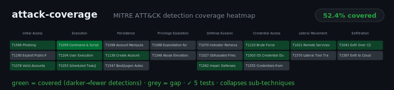

# attack-coverage

[](https://github.com/JCreatesGH/attack-coverage/actions)
[](https://www.python.org/)
[](LICENSE)

Map your detections to the **MITRE ATT&CK** matrix and see exactly where your coverage gaps are — as a heatmap and a per-tactic gap list. Answer "what can't we detect?" with evidence.



## Install

```bash
pip install attackcov
```

## Use it

```python
from attackcov import Detection, coverage_by_tactic, gaps, coverage_score, render_svg

detections = [
    Detection("Brute force login", ["T1110"]),
    Detection("Suspicious PowerShell", ["T1059.001"]),   # sub-techniques collapse to T1059
    Detection("Phishing link", ["T1566", "T1204"]),
]

coverage_score(detections)        # 38.5  (% of techniques with >=1 detection)
coverage_by_tactic(detections)    # {"Execution": {"covered": 2, "total": 3, "pct": 66.7}, ...}
gaps(detections)                  # {"Exfiltration": ["T1041", "T1567"], ...}

open("coverage.svg", "w").write(render_svg(detections))

from attackcov import navigator_layer
import json
json.dump(navigator_layer(detections), open("layer.json", "w"))  # import into ATT&CK Navigator
```

## CLI

Installing the package adds an `attackcov` command. Feed it a JSON list of detections
(`[{name, techniques:[...]}]`):

```bash
$ attackcov detections.json                            # coverage %, per-tactic table, gaps
$ attackcov detections.json --navigator > layer.json   # MITRE ATT&CK Navigator layer
$ attackcov detections.json --svg > coverage.svg       # heatmap
$ attackcov detections.json --min-score 60             # exit 1 if coverage < 60% (CI gate)
```

## Notes

- **Sub-techniques collapse** to their parent (`T1059.001` → `T1059`); technique IDs not in the matrix are ignored for scoring but surfaced separately (typo-catcher) via `unknown_techniques`.
- The heatmap colors each technique by **how many** detections cover it (darker green = fewer, grey = none), with a `<title>` tooltip per cell.
- `navigator_layer` produces a v4 layer you can import straight into the **MITRE ATT&CK Navigator**.
- Ships with a compact slice of the ATT&CK Enterprise matrix across 8 tactics; extend `TACTICS` to match your environment.

## Development

```bash
pip install -e .[dev] && python -m pytest -q   # 9 tests
```

## License

MIT
